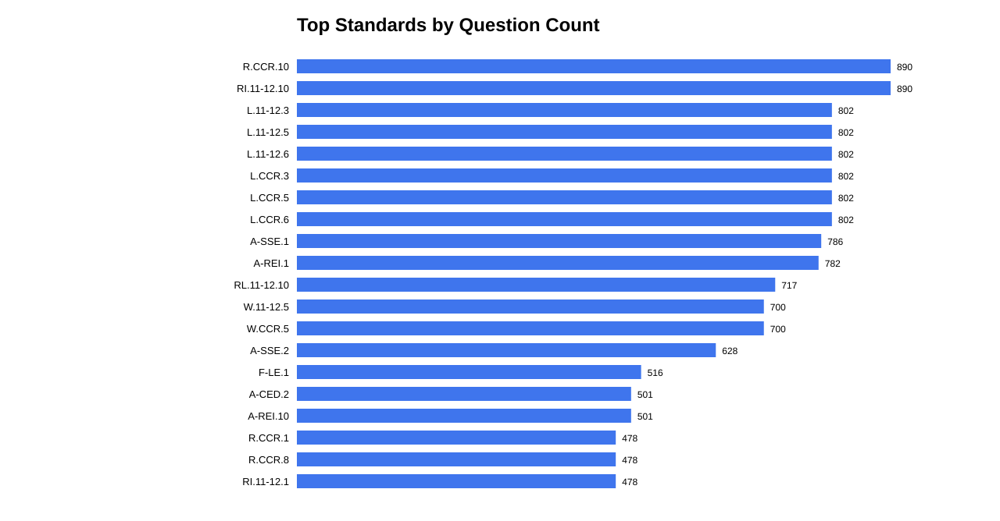
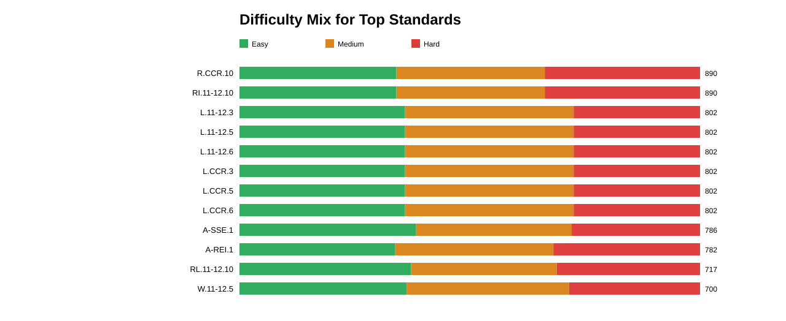
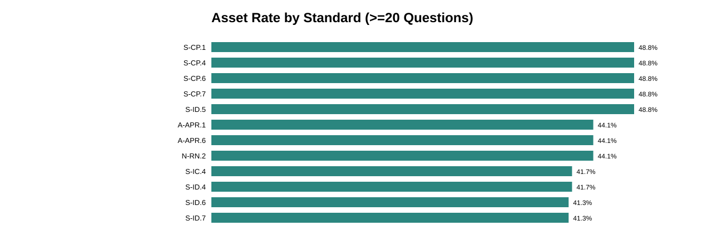

# State Standards Coverage Report

This report analyzes the current downloaded SAT Question Bank dataset and highlights coverage balance, difficulty mix, and asset complexity by state standard.

## Dataset Summary

- Total questions analyzed: **3268**
- Unique standards observed: **115**
- Question-standard links (weighted): **32095**
- Average standards tagged per question: **9.82**
- Questions with one or more assets: **431** (13.2%)
- Total assets across all questions: **3332**

## Coverage Imbalance

### Top Standards by Question Count

| Standard | Questions | Share of Questions |
| --- | --- | --- |
| R.CCR.10 | 890 | 27.2% |
| RI.11-12.10 | 890 | 27.2% |
| L.11-12.3 | 802 | 24.5% |
| L.11-12.5 | 802 | 24.5% |
| L.11-12.6 | 802 | 24.5% |
| L.CCR.3 | 802 | 24.5% |
| L.CCR.5 | 802 | 24.5% |
| L.CCR.6 | 802 | 24.5% |
| A-SSE.1 | 786 | 24.1% |
| A-REI.1 | 782 | 23.9% |
| RL.11-12.10 | 717 | 21.9% |
| W.11-12.5 | 700 | 21.4% |
| W.CCR.5 | 700 | 21.4% |
| A-SSE.2 | 628 | 19.2% |
| F-LE.1 | 516 | 15.8% |
| A-CED.2 | 501 | 15.3% |
| A-REI.10 | 501 | 15.3% |
| R.CCR.1 | 478 | 14.6% |
| R.CCR.8 | 478 | 14.6% |
| RI.11-12.1 | 478 | 14.6% |

### Low-Coverage Standards (<= 50 questions)

| Standard | Questions | Coverage Label |
| --- | --- | --- |
| S-IC.3 | 11 | Low |
| S-IC.6 | 11 | Low |
| S-IC.4 | 24 | Low |
| S-ID.4 | 24 | Low |
| S-IC.1 | 35 | Low |
| S-CP.1 | 43 | Low |
| S-CP.4 | 43 | Low |
| S-CP.6 | 43 | Low |
| S-CP.7 | 43 | Low |
| S-ID.5 | 43 | Low |
| G-C.2 | 50 | Low |
| G-C.5 | 50 | Low |
| G-CO.4 | 50 | Low |
| G-CO.5 | 50 | Low |
| G-GPE.1 | 50 | Low |
| G-GPE.4 | 50 | Low |

## Difficulty Distribution by Standard

### Hardest-Leaning Standards (Hard share minus Easy share)

| Standard | Hard-Easy Bias | Questions |
| --- | --- | --- |
| G-C.2 | +0.60 | 50 |
| G-C.5 | +0.60 | 50 |
| G-CO.4 | +0.60 | 50 |
| G-CO.5 | +0.60 | 50 |
| G-GPE.1 | +0.60 | 50 |
| G-GPE.4 | +0.60 | 50 |
| G-SRT.6 | +0.39 | 54 |
| G-SRT.7 | +0.39 | 54 |
| G-SRT.8 | +0.39 | 54 |
| R.CCR.1 | +0.15 | 478 |
| R.CCR.8 | +0.15 | 478 |
| RI.11-12.1 | +0.15 | 478 |

### Easiest-Leaning Standards

| Standard | Hard-Easy Bias | Questions |
| --- | --- | --- |
| S-CP.1 | -0.35 | 43 |
| S-CP.4 | -0.35 | 43 |
| S-CP.6 | -0.35 | 43 |
| S-CP.7 | -0.35 | 43 |
| S-ID.5 | -0.35 | 43 |
| F-IF.5 | -0.33 | 151 |
| S-ID.6 | -0.32 | 63 |
| S-ID.7 | -0.32 | 63 |
| G-MG.2 | -0.29 | 84 |
| N-Q.1 | -0.29 | 84 |
| A-REI.3 | -0.27 | 257 |
| F-IF.6 | -0.22 | 187 |

## Difficulty and Answer-Type Interaction

| Question Type | Count | Share |
| --- | --- | --- |
| Multiple Choice | 2865 | 87.7% |
| Student-Produced Response | 403 | 12.3% |

| Difficulty | Count | Share |
| --- | --- | --- |
| Easy | 1172 | 35.9% |
| Medium | 1088 | 33.3% |
| Hard | 1008 | 30.8% |

## Asset Complexity by Standard

| Standard | Asset Rate | Avg Assets/Question | Questions |
| --- | --- | --- | --- |
| S-CP.1 | 48.8% | 2.02 | 43 |
| S-CP.4 | 48.8% | 2.02 | 43 |
| S-CP.6 | 48.8% | 2.02 | 43 |
| S-CP.7 | 48.8% | 2.02 | 43 |
| S-ID.5 | 48.8% | 2.02 | 43 |
| A-APR.1 | 44.1% | 4.55 | 102 |
| A-APR.6 | 44.1% | 4.55 | 102 |
| N-RN.2 | 44.1% | 4.55 | 102 |
| S-IC.4 | 41.7% | 1.12 | 24 |
| S-ID.4 | 41.7% | 1.12 | 24 |
| S-ID.6 | 41.3% | 2.51 | 63 |
| S-ID.7 | 41.3% | 2.51 | 63 |

## Score-Band Signal by Standard

| Standard | Avg Score Band | Questions |
| --- | --- | --- |
| G-C.2 | 5.74 | 50 |
| G-C.5 | 5.74 | 50 |
| G-CO.4 | 5.74 | 50 |
| G-CO.5 | 5.74 | 50 |
| G-GPE.1 | 5.74 | 50 |
| G-GPE.4 | 5.74 | 50 |
| G-SRT.6 | 5.24 | 54 |
| G-SRT.7 | 5.24 | 54 |
| G-SRT.8 | 5.24 | 54 |
| R.CCR.1 | 4.72 | 478 |
| R.CCR.8 | 4.72 | 478 |
| RI.11-12.1 | 4.72 | 478 |

## Tag Density

| Standards per Question | Questions | Share |
| --- | --- | --- |
| 1 | 76 | 2.3% |
| 3 | 304 | 9.3% |
| 4 | 86 | 2.6% |
| 5 | 422 | 12.9% |
| 6 | 623 | 19.1% |
| 8 | 203 | 6.2% |
| 9 | 245 | 7.5% |
| 11 | 130 | 4.0% |
| 14 | 387 | 11.8% |
| 15 | 151 | 4.6% |
| 16 | 182 | 5.6% |
| 17 | 117 | 3.6% |
| 20 | 226 | 6.9% |
| 22 | 116 | 3.5% |

## How This Helps Test Takers

- Prioritize high-frequency standards first; they appear most often and are likely to yield the largest score impact.
- Add a targeted practice block for low-coverage standards so rare skills do not become blind spots.
- Use hardest-leaning standards as late-stage prep after foundational easy/medium coverage is stable.
- If visual-heavy standards are a weakness, include timed drills with diagrams/charts to reduce interpretation overhead.
- Track score-band-heavy standards to focus on questions that tend to cluster at higher challenge levels.
